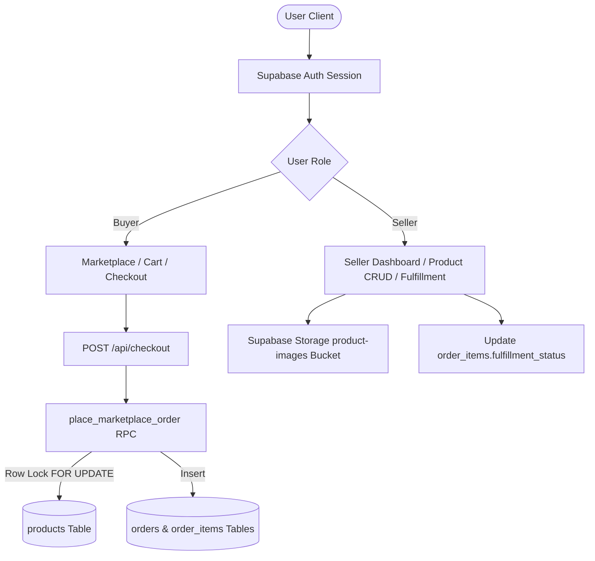

# MakersMarket 🇮🇳🛍️ — India-First Two-Sided Creator Marketplace

**MakersMarket** is a modern, production-grade, full-stack multi-vendor e-commerce marketplace localized for **India (INR ₹)**. Built with **Next.js App Router**, **TypeScript**, **Tailwind CSS**, and **Supabase (PostgreSQL, Auth, Storage, and RLS)**.

The platform connects independent Indian creators, small-batch artisans, and boutique studios directly with buyers across India. It features role-based onboarding, seller product management with direct image uploads, an active public marketplace, cart management, server-authoritative Cash on Delivery checkout with Indian PIN Code & Mobile validation, buyer order history, item-level seller fulfillment workflows, and realized seller dashboard metrics in INR.

---

## 🌟 Key Features

### 🛒 Buyer Experience
- **Role-Aware Onboarding**: Personalized onboarding flow to set product category interests and shopping budget in INR (`Under ₹500`, `₹500–₹2,000`, `₹2,000–₹5,000`, `₹5,000+`).
- **Dynamic Marketplace & Search**: Browse live active products with real-time text search, category filters, and INR price sorting.
- **Personalized Recommendations**: "Picked for You" algorithm prioritizing catalog items matching the buyer's onboarding preferences.
- **Product Detail Views**: Stock quantity clamping, full image previews, and seller storefront badges.
- **Persistent Cart Drawer**: Slide-over cart drawer with item count controls and subtotal calculation in INR (`₹`).
- **Indian Cash on Delivery Checkout**: Delivery address form with Full Name, 10-digit Mobile validation, Address Lines, Locality, City, Indian State dropdown, and 6-digit PIN Code validation.
- **Order History**: Track past orders and view item-level fulfillment badges (`Pending` → `Confirmed` → `Shipped` → `Delivered`).

### 🏬 Seller Experience
- **Storefront Onboarding**: Create custom store profiles with brand names, bio, category, and custom store slugs (e.g. `Bengaluru, Karnataka`).
- **Product Management (CRUD)**: Create, edit, view, activate/deactivate listings, and delete products with confirmation modals.
- **Direct Image Uploads**: Product images uploaded directly to Supabase Storage with folder-scoped user ownership.
- **Item-Level Fulfillment**: Sellers view and update fulfillment status (`Pending` → `Confirmed` → `Shipped` → `Delivered` or `Cancelled`) strictly for order items belonging to their store.
- **Seller Metrics Dashboard**: Realized revenue calculation in INR (`₹`) computed strictly from `Delivered` order items (`unit_price * quantity`), low-stock warnings (`stock <= 5`), and sales analytics.

### 🛡️ Platform & Security
- **Strict Role-Based Access Control**: Protected route guards (`RouteGuard`) preventing buyers from accessing seller dashboards and vice versa.
- **Row Level Security (RLS)**: Fine-grained PostgreSQL RLS policies enforcing profile isolation, product ownership, order visibility, and storage folder permissions.
- **Atomic Checkout RPC (`place_marketplace_order`)**: Single PL/pgSQL transaction with row-locking (`FOR UPDATE`) to prevent overselling, race conditions, and client price tampering.

---

## 🛠️ Technology Stack

- **Framework**: [Next.js 14 (App Router)](https://nextjs.org/)
- **Language**: [TypeScript](https://www.typescriptlang.org/)
- **Styling**: [Tailwind CSS](https://tailwindcss.com/)
- **Backend & Database**: [Supabase](https://supabase.com/) (PostgreSQL)
- **Authentication**: Supabase Auth (Email & Password with metadata triggers)
- **File Storage**: Supabase Storage (`product-images` bucket)
- **Icons**: [Lucide React](https://lucide.dev/)

---

## 🏗️ Architecture & Data Flow Overview



---

## 📊 Database Schema Overview

The database consists of 5 core relational tables in PostgreSQL:

1. `public.profiles`: Stores user identities, roles (`buyer` | `seller`), onboarding status, category preferences, and budget.
2. `public.seller_profiles`: Stores seller store names, unique store slugs, descriptions, categories, and logos.
3. `public.products`: Stores product listings, INR prices, stock, image URLs, active status (`is_active`), and seller references.
4. `public.orders`: Stores parent buyer orders, total amounts in INR, Indian shipping addresses, and payment methods (`cash_on_delivery`).
5. `public.order_items`: Stores individual ordered items with item-level `fulfillment_status` (`Pending`, `Confirmed`, `Shipped`, `Delivered`, `Cancelled`).

---

## 🚀 Getting Started

### Prerequisites
- Node.js (v18.x or higher)
- npm or yarn
- A free [Supabase](https://supabase.com/) account and project

### 1. Clone & Install Dependencies
```bash
git clone https://github.com/your-username/e-commerce-marketplace.git
cd e-commerce-marketplace
npm install
```

### 2. Configure Environment Variables
Copy `.env.example` to `.env.local`:
```bash
cp .env.example .env.local
```
Fill in your Supabase project credentials in `.env.local`:
```env
NEXT_PUBLIC_SUPABASE_URL=https://your-project-id.supabase.co
NEXT_PUBLIC_SUPABASE_ANON_KEY=your-anon-key-here
```

### 3. Run Database Schema Setup
1. Log in to your **Supabase Dashboard** → Select your project.
2. Go to **SQL Editor** (`>_` icon on left menu).
3. Open `supabase/schema.sql` from this repository, copy all contents, paste into SQL Editor, and click **Run**.

### 4. Start Development Server
```bash
npm run dev
```
Open [http://localhost:3000](http://localhost:3000) in your browser.

---

## 🔒 Security Highlights

- **Server-Authoritative Pricing**: The client cart submits only product IDs and requested quantities. All prices in INR, stock availability, and totals are computed server-side directly inside the PostgreSQL RPC transaction.
- **Race Condition Prevention**: `place_marketplace_order` uses `SELECT ... FOR UPDATE` to lock product rows during validation, preventing overselling.
- **Storage Ownership RLS**: Storage uploads to the `product-images` bucket are strictly scoped to `<user_id>/<filename>` paths, enforced by RLS policy `(storage.foldername(name))[1] = auth.uid()::text`.

---

## 🔮 Future Scope

- Integration with real online payment gateways (Razorpay, UPI, PayTM).
- Product review and rating submission engine for verified buyers.
- Customer wishlist and saved items drawer.
- Real-time order status notifications via WebSockets / Supabase Realtime.
- Advanced analytics & CSV export for seller financial reporting.

---

## 👥 Contributors

This project was developed for demonstration and submission purposes.

- **Project Lead & Developer**: [Your Name / Username]
- **Repository**: [GitHub Repository Link]
